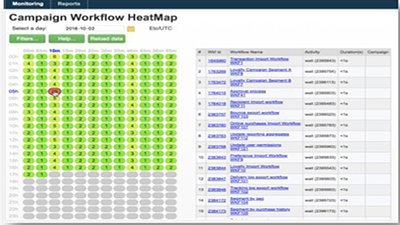
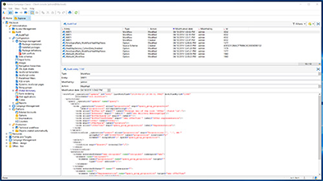
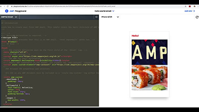

# Adobe Campaign Classic V7 教程 - 概述

Adobe Campaign 提供了跨渠道客户体验设计平台，并为可视化的活动编排、实时互动管理和跨渠道执行提供了环境。本用户指南包含了有关 Adobe Campaign Classic V7 的众多特性和功能的视频和教程。

>[!INFO]
> 你有问题吗？ 您想与同行分享您的经验或交流想法吗？ 或者，您是否对Adobe团队的学习内容有反馈？
在[Adobe Campaign学习社区线程](https://experienceleaguecommunities.adobe.com/t5/adobe-campaign-classic/join-the-discussion-around-adobe-campaign-learning/td-p/419096)中加入对话！

## 新增功能

* **[创建跨渠道活动](/help/orchestrating-campaigns/cross-channel-campaigns.md)**

   *了解如何创建和执行跨渠道活动。*

* **[使用对照组](/help/sending-messages/email-channel/use-control-groups.md)**

   *了解对照组的概念以及如何将对照组用于投放。*

* **[发送并确认验证](/help/sending-messages/email-channel/send-and-validate-proofs.md)**

   *了解如何发送并确认验证。*

* **[设计可投放的电子邮件](/help/sending-messages/email-channel/design-emails-for-deliverability.md)**

   *了解如何应用可投放性最佳实践。*

* **[创建和设计电子邮件投放](/help/sending-messages/email-channel/create-and-design-email-deliveries.md)**

   *了解创建电子邮件投放的过程，并了解如何设计和个性化电子邮件内容。*

## 员工挑选

<table>
<tr>
  <td>
    
    

      <a href="./monitoring-campaign-classic/workflow-heatmap.md">
    <strong>工作流热图</strong>
    </a>
    

    

    <em>获取并发工作流数的概述。</em>
    

  </td>
   <td>
    
    

      <a href="./monitoring-campaign-classic/audit-trail.md">
    <strong>审核记录</strong>
    </a>
    
 
    

    <em>捕获在 Adobe Campaign 内发生的操作和事件的全面列表。</em>
    

  </td>
  <td>
    
    

      <a href="./sending-messages/email-channel/defining-interactive-email-content-with-amp.md">
    <strong>使用 AMP 定义交互式电子邮件内容</strong>
    </a>
    

    

    <em>了解如何在 Adobe Campaign Classic 中激活和使用 AMP </em>
    

  </td>
</tr>
</table>

## 其他资源

* [文档](https://final-docs.campaign.adobe.com/doc/AC/en/PTF_Starting_with_Adobe_Campaign_About_Adobe_Campaign_Classic.html)
